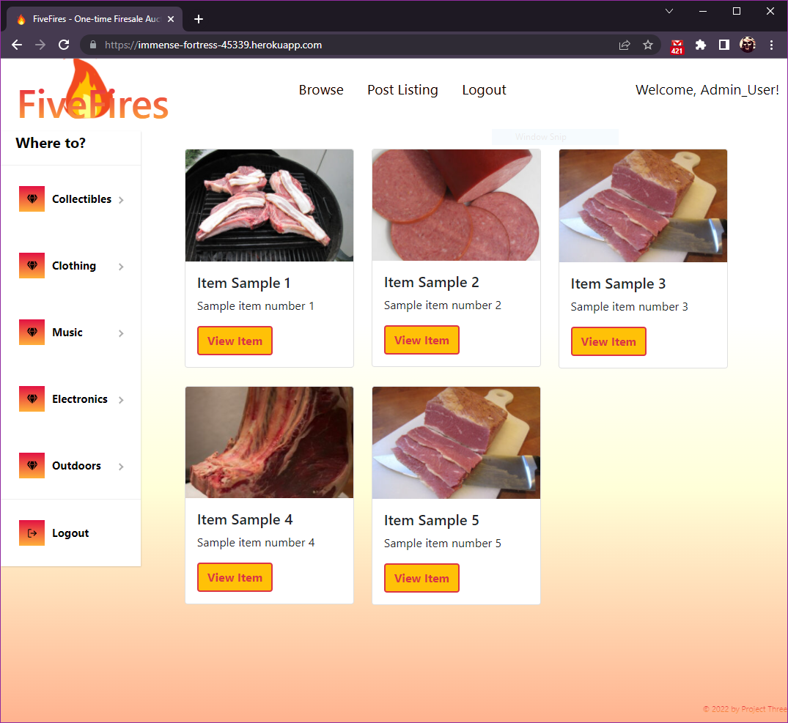

# Project-Three FiveFires

 ## Table of Contents
  * [Application Description](#application-description)
  * [Application Installation](#application-installation)
  * [How to Use](#how-to-use)
  * [Application Built With](#application-built-with)
  * [Screenshot](#screenshot)
  * [Deployed Application](#deployed-application)
  * [Collaborators](#collaborators)

## Application Description
This application is an auction style website where users can sign-up/login and either post their goods or bid to purchase other users' goods. 
There is also a review system of users using a five-scale rating, also known as "Five Fires".

## Application Installation
To install, clone the respository onto your local computer, run `npm install` in the root directory, then run `npm run develop`. 

## Application Built With
• React.js  
• Apollo  
• Bootstrap  
• GraphQL  
• Jwt-decode  
• Bcrypt  
• Express  
• Mongoose  
• JSON Web Token  
• Nodemon

## Application
[GitHub: Code](https://github.com/AshtonBrugh/project-three)  
[Heroku: Deployment](https://immense-fortress-45339.herokuapp.com/)

## Screenshot

## Collaborators
• [Scott Howell](https://github.com/CyanideTheJuggla)  
• [Tre Rush](https://github.com/Rush0218)  
• [David Siedlarz](https://github.com/DSiedlarz90)  
• [Ashton Brugh](https://github.com/AshtonBrugh) 

